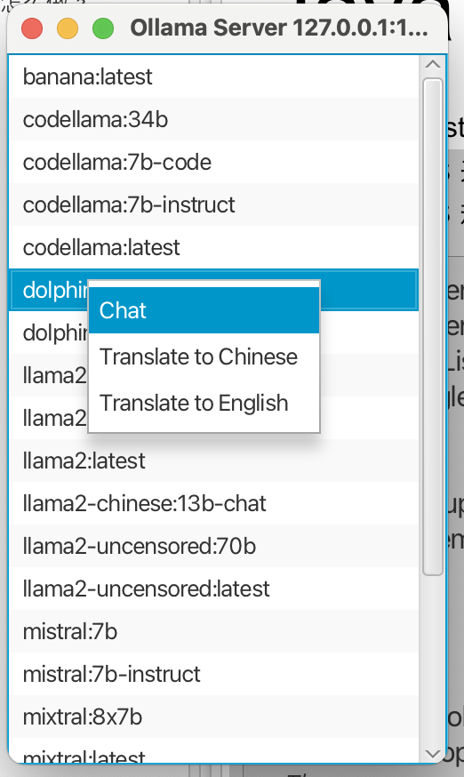
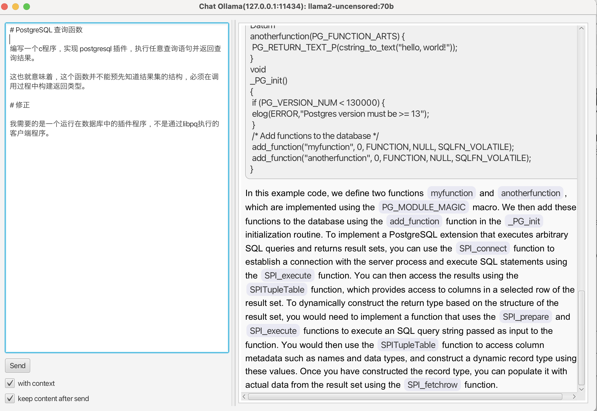

# In The Shell


## prepare

* java21
* javafx 21.0.1

## build

just 

```shell
mvn clean package
```

## run jar

For example, we prepare javafx libraries in path `~/jobs/javafx-sdk-21.0.1` 。

Then, run it

```shell
java --module-path ~/jobs/javafx-sdk-21.0.1/lib \
      --add-modules javafx.controls,javafx.fxml \
      -jar target/in-the-shell-1.0-SNAPSHOT-jar-with-dependencies.jar
```

## usage

In the shell app list models after started. Just right click and select run mode in context menu:



The chat window should be designed as "Meeting" or "Discussion", instead of "Chatting". We can send 
content from the left panel and read Markdown format historical records on the right side. 
Double-clicking any record will copy it to the system clipboard. The AI's response will appear in a 
streamlined manner.



## future

* today it just connect to local ollama in localhost:11434, in future we can configure servers in configuration
* maybe sometime it can connect to 

